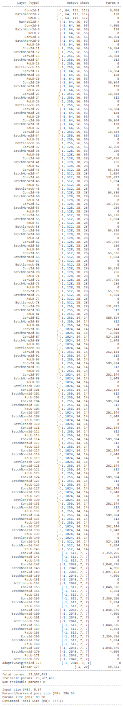

# EE541 Project - CV For American Sign Language

Course title: EE 541 – Computational Introduction to Deep Learning

University: University of Southern California (USC)

Instructor: Dr. Brandon Franzke

Semester: Spring 2024

Student Team: Anuja Shah, Shounak Das

# Repository Structure
This repository contains 3 jupyter notebook files. Two for SqueezeNet Model - one for 1 epoch run, another for 10 epoch runs as 1 epoch offers better generalization. One for ResNet-50. To run the notebooks, the datasets linked below are needed.

# Required Packages
- [PyTorch](https://pytorch.org/) 
- [Torch-Summary](https://pypi.org/project/torch-summary/)
- [Matplotlib](https://matplotlib.org/)
- [Pandas](https://pandas.pydata.org/)
- [Numpy](https://numpy.org/)
- [Sklearn](https://scikit-learn.org/stable/)
- [Rich](https://github.com/Textualize/rich)

# Dataset
The training dataset used for this project is available on Kaggle as the [ASL Alphabet](https://www.kaggle.com/grassknoted/asl-alphabet) Dataset. The external test dataset used is also available at Kaggle as [Test Dataset](https://www.kaggle.com/datasets/danrasband/asl-alphabet-test)

## About the Dataset

### Training Dataset
This dataset contains images for alphabets in the American Sign Language. The dataset is approximately 1 GB. The training data (1.02 GB) set contains 87,000 images, each of which is 200x200 pixels. There are 29 total classes. The letters A-Z are represented by 26 of the classes, and the other 3 classes are for *space*, *delete*, and *nothing*. On the other hand, the test data (323 kB) set contains only 29 images, as the dataset is intended to be tested on real-world test images.

### External Test Dataset
This data set consists of a set of 870 images. Each image contains a hand making the shape of an ASL letter (with some variation). The purpose of this data set is to act as a sort of validation set to see how good the preprocessing and the model are. We selected this dataset to augment the original final test dataset as we wanted to test how the model performs in classifying symbols against vastly different backgrounds. There are 30 images for each symbol, A-Z, delete, space, and nothing, making 870 images in total. The images are 200x200 8-bit photos to match the asl-alphabet data set, and are organized in a folder structure.

# Model
We used 2 forms of pre-trained CNN-based models for transfer learning: SqueezeNet and Resnet-50

## SqueezeNet Architecture:

## ResNet-50 Architecture:

# Parameters
For SqueezeNet:
- Batch size: 64
- Optimiser: Adam
- Learning Rate: Initially 0.001
- 10 Epochs total

For Resnet-50:
- Batch size: 64
- Optimiser: Adam
- Learning Rate: Initially 0.001
- 25 Epochs total

# Compute Needs:
Our algorithm was run on Kaggle which offered various accelerators to use. We opted for the GPU T4 x2 option. This allowed us to run 2 GPUs in parallel to speed up training. Overall, training and testing on the entire daset took roughly ~8 hours for the ResNet-50 and ~110 minutes for the SqueezeNet.

# Model Size:
Resnet-18: ~50 Mb
EfficientNet-B0: ~50 Mb

# Results
Our best generalized SqueezeNet model (1 epoch) gave us:
- Accuracy on the training data-set: 88.19%. 
- Accuracy on the validation data-set: 97.80%.
- Accuracy on the testing data-set: 97.54%. 

Our best ResNet-50 model gave us:
- Accuracy on the training data-set: 98.69%. 
- Accuracy on the validation data-set: 97.69%.
- Accuracy on the testing data-set: 97.47%.

- Best Accuracy on external test data (SqueezeNet - 1 epoch): 29.96%
